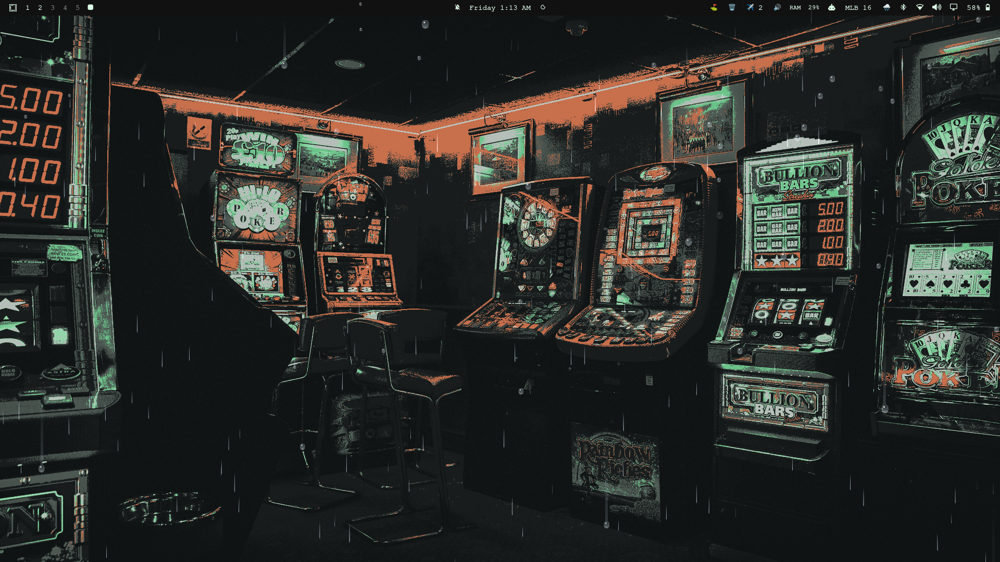

# Pane

Weather on the inside of your screen.

Pane draws rain, snow and storms on a transparent, click-through layer over
your desktop. Streaks fall across your windows, droplets bead up on the glass
and run down it leaving a trail, and a thunderstorm throws the occasional
double-strike of lightning across everything.

Every click, drag and hover passes straight through it. You can work normally
with a downpour running.



## Install

```
omarchy plugin add https://github.com/Bert0424/omarchy-pane.git
omarchy plugin enable bert.pane
```

Then add the **Pane** widget to your bar from the bar settings. Left-click the
pill for the tuning popup; middle-click toggles the weather off and on.

## Remove

```
omarchy plugin disable bert.pane
omarchy plugin remove bert.pane
```

Nothing is left behind — see *What it does to your system* below.

## Settings

| Setting | What it does |
| --- | --- |
| **Show weather** | Master on/off. When off, the overlay surface is destroyed, not hidden. |
| **Conditions** | Drizzle, Rain, Downpour, Thunderstorm, Snow. |
| **Density** | Sparse / Normal / Heavy multiplier. |
| **Wind** | None (straight down, the default), Light, Gusty. |
| **Layer** | On the desktop, in front of windows, or above everything. |
| **Falling rain** | The streaks crossing the screen. |
| **Droplets on the glass** | Beads that cling, then run down leaving a trail. |
| **Lightning** | Thunderstorm only. |
| **Pause over fullscreen windows** | Stops completely for games and video. |

Conditions are currently chosen by hand. Live weather from your actual location
is planned but not implemented — Pane does not touch the network today.

## Performance

The effect is real rendering, so it is not free. Measured on an 11th-gen Intel
iGPU at 1920x1080, as a share of one core:

| State | Cost |
| --- | --- |
| Off (surface destroyed) | ~3% (shell baseline) |
| Drizzle / Normal | ~13% |
| Rain / Normal | ~15% |
| Downpour / Normal | ~17% |
| Thunderstorm / Heavy | ~22% |

Two design choices keep this bounded. When there is no weather the layer-shell
surface is unmapped entirely rather than hidden, so being switched off costs
nothing. And with *Pause over fullscreen windows* on, the surface is destroyed
whenever a window goes fullscreen, so games and video are untouched.

## What it does to your system

Deliberately very little:

- **Files written:** none. Your settings live in the Omarchy shell's own
  `shell.json` through the standard bar-widget mechanism, exactly like every
  first-party widget. Pane itself writes nothing to disk.
- **Network:** none. No requests, no telemetry, no analytics, no accounts.
- **Commands run:** none. Pane starts no subprocesses.
- **Privileges:** none. It runs entirely as your user inside the shell process
  and needs no elevated permissions of any kind.
- **Reads:** one thing — Hyprland's event socket
  (`$XDG_RUNTIME_DIR/hypr/$HYPRLAND_INSTANCE_SIGNATURE/.socket2.sock`),
  read-only, purely to notice when a window enters or leaves fullscreen so the
  effect can pause. Only lines beginning with `fullscreen>>` are parsed and
  everything else is ignored. Turn *Pause over fullscreen windows* off and the
  socket is never opened.
- **Draws:** one transparent layer-shell surface per screen, in the
  `bert-pane` namespace, with an empty input region so it can never intercept
  input.

Removing the plugin removes all of it; there is no daemon, no state file and no
external resource to clean up.

## Limitations

The droplets do not refract what is behind them. A Wayland layer surface has no
read access to the composited framebuffer beneath it, so true glass distortion
is not possible without screen capture, which Pane deliberately does not do.
The beads are painted with rim light, a specular highlight and a trail instead,
which reads convincingly.

## Requirements

Omarchy's Quickshell-based shell, on Hyprland.

## License

MIT — see [LICENSE](LICENSE).
